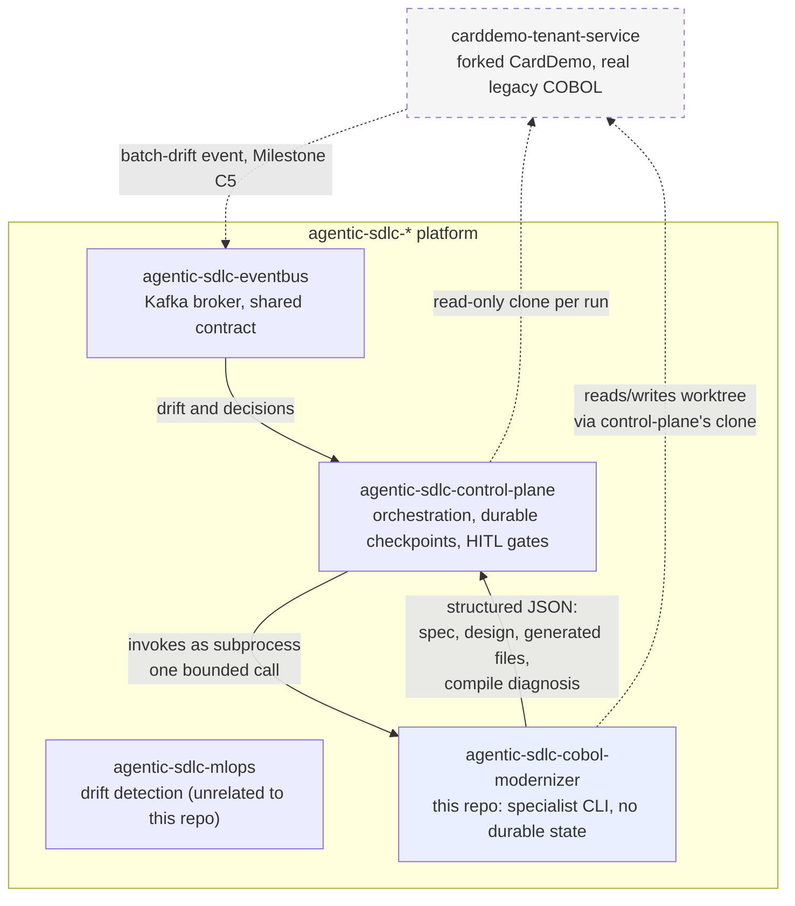
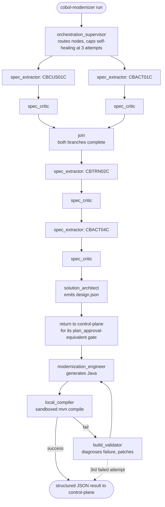

# agentic-sdlc-cobol-modernizer

COBOL-to-Java modernization specialist for the `agentic-sdlc-*` platform. Invoked as a CLI
subprocess by [`agentic-sdlc-control-plane`](https://github.com/jayakumar-devaraj/agentic-sdlc-control-plane)
— it has no ingress API, no durable checkpointer, and no human-in-the-loop gates of its own; see
[`docs/adr/0001-the-specialist-is-a-subprocess-not-a-second-control-plane.md`](docs/adr/0001-the-specialist-is-a-subprocess-not-a-second-control-plane.md)
for why.

## Tech stack

- **Language**: Python 3.12
- **Internal sub-pipeline**: LangGraph (in-process, in-memory checkpointer — not durable; see
  ADR-0001)
- **State/validation**: Pydantic
- **Testing**: pytest, pytest-cov

## Architecture

This is the design the implementation is built against, not a record of what already exists —
the specialist nodes below land incrementally across Milestones C2–C4 (tracked in
[`docs/adr/`](docs/adr/) and the repo's task list), but the shape doesn't change as they do.
Today only the CLI skeleton is real; everything else in these diagrams is the target.

### How this repo fits in the platform



Every solid arrow into or out of this repo is a single bounded subprocess call. This repo never
talks to Kafka, Postgres, or the tenant repo's git remote directly — control-plane owns the clone
and hands this repo a worktree path (`docs/adr/0001`).

### This repo's internal pipeline



`CBCUS01C` (customer) and `CBACT01C` (account) share no copybook dependency (verified in
`docs/cobol-construct-support-matrix.md`) and run as parallel branches; `CBTRN02C` and `CBACT04C`
both depend on account data and run after the join. The self-healing loop is a bounded retry, not
an open-ended one — a third failed compile returns to control-plane rather than looping forever.

### What this design deliberately doesn't buy

- **No resume mid-pipeline.** A crash during this repo's own invocation loses that invocation's
  progress; control-plane recovers by re-invoking the CLI, not by anything built here
  (`docs/adr/0001`, Consequences).
- **`spec_critic`'s confidence score is the only independent check on extraction quality** for
  Track C. It is not a second, adversarial review — see the same ADR for why `REDEFINES`/
  `OCCURS DEPENDING ON` (Track B) get a stricter, mandatory gate instead of a confidence score.
- **The parser has a hard, enforced boundary.** `REDEFINES`, `OCCURS DEPENDING ON`, and
  `COPY REPLACING` are detected and rejected, never partially interpreted (`docs/adr/0002`).

## Quickstart

```bash
py -3.12 -m venv .venv
./.venv/Scripts/pip install -e ".[dev]"
./.venv/Scripts/cobol-modernizer run --program CBACT04C --tenant-repo <path> --output <path> --json
```

Currently returns a `not_implemented` status — this is expected until Milestone C2.

## Local development

No local infrastructure of its own to stand up yet. The knowledge store (Milestone C2) and any
persistent state reuse `agentic-sdlc-control-plane`'s existing Postgres instance rather than a
second database — a docker-compose stack for this repo is deferred until there's a real service
to run (the sandboxed Maven compiler, Milestone C4), rather than shipped empty to check a box.

## Testing

```bash
./.venv/Scripts/python -m pytest --cov=cobol_modernizer --cov-report=term-missing --cov-fail-under=90
```

5 tests passing, 90% coverage as of Milestone C1 — the number a real run produces, not a claim.

## Deployment / CI

`.github/workflows/ci.yml` runs lint + the test suite with the coverage floor above on every push
and pull request. No deployment pipeline yet — this repo has nothing running in production until
control-plane's specialist router (Track P) can invoke it, and Kubernetes/Terraform manifests
(Track P4, in `agentic-sdlc-control-plane`) exist to run it against.
