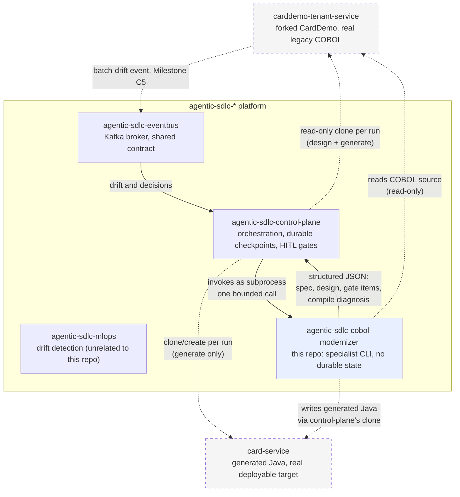
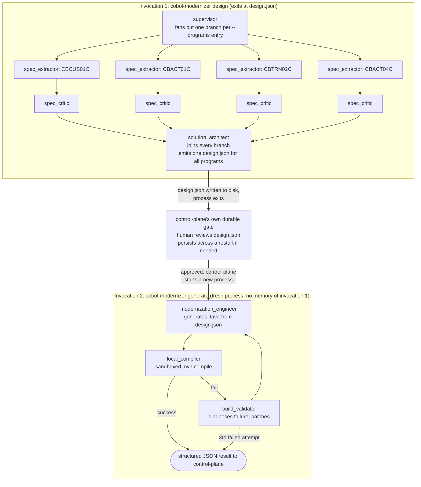

# agentic-sdlc-cobol-modernizer

COBOL-to-Java modernization specialist for the `agentic-sdlc-*` platform. Invoked as a CLI
subprocess by [`agentic-sdlc-control-plane`](https://github.com/jayakumar-devaraj/agentic-sdlc-control-plane)
— it has no ingress API, no durable checkpointer, and no human-in-the-loop gates of its own; see
[`docs/adr/0001-the-specialist-is-a-subprocess-not-a-second-control-plane.md`](docs/adr/0001-the-specialist-is-a-subprocess-not-a-second-control-plane.md)
for why.

## Tech stack

- **Language**: Python 3.12
- **Internal sub-pipeline**: LangGraph (in-process, in-memory checkpointer — not durable; see
  ADR-0001)
- **State/validation**: Pydantic
- **LLM client**: `anthropic` SDK — model per node resolved from `config/model_routing.yaml`
  (static, not a routing engine; see ADR-0004)
- **Config**: PyYAML (`config/model_routing.yaml`)
- **Testing**: pytest, pytest-cov

## Architecture

**The `design` half of the diagram below is real and runs end to end today.**
`cobol-modernizer design` executes a compiled LangGraph (ADR-0012): one concurrent branch per
requested program running `spec_extractor` then `spec_critic`, joining into a single
`solution_architect` pass that unifies every program's shared copybooks (`Account`/`CVACT01Y` alone
spans three of the four Track C programs) into one domain model (ADR-0010). It writes a real
`design.json` — including `gate_items`, the concrete payload control-plane's gate reviews (see "How
human review actually happens" below) — plus one `spec.md` per program, and reports a summary on
stdout. Every tool underneath (`parsing/`, `pic_mapper`, `tenant_repo`, `guardrails`,
`knowledge_store`, `model_routing`, `source_units`, `structured_output`) is independently tested
against real CardDemo source (`docs/qa/verification-report.md`).

Every model call goes through one client (`core/model_client.py`, ADR-0013) that owns backend
choice, timeout, bounded retry with jittered backoff, and per-call token/cost capture — so no node
reimplements any of that, and a rate limit is handled once rather than three times. Program
branches are capped rather than fanning out without limit.

Two honest limits. **No full `design` run against real models has happened yet** — a live
round-trip through the `claude` CLI is verified, but no `spec.md` has been narrated, critiqued, or
architected by a real model and read by a human, so output *quality* is unevaluated. And the
**`generate` half does not exist yet** (Milestone C4), so `modernization_engineer`,
`build_validator`, and the self-healing compile loop in the diagram are target design, not built
code.

### How this repo fits in the platform



Every solid arrow into or out of this repo is a single bounded subprocess call. This repo never
talks to Kafka, or either repo's git remote, directly — control-plane owns both clones and hands
this repo worktree paths (`docs/adr/0001`).
[`card-service`](https://github.com/jayakumar-devaraj/card-service) (ADR-0009) is the `generate`
phase's write target — not this repo's own output, and not `carddemo-tenant-service`'s, which
stays read-only source of truth throughout. The repo itself exists (an empty scaffold — no
generated Java yet, Milestone C4 hasn't started); `generate` writing real content into it is still
real work ahead. This
repo does talk to Postgres directly, but only for the knowledge store's own schema
(`tools/knowledge_store.py`), via a credentials file path, never an embedded credential
(`docs/adr/0005`) — durable orchestration state stays entirely control-plane's concern.

### This repo's internal pipeline — two separate, independently bounded invocations

Not one continuous flow: this repo has no durable state (ADR-0001), so it cannot pause mid-run for
a human gate and resume later. Control-plane's gate sits *between* two separate process
invocations, never inside one (ADR-0003).



**Every** program runs as its own concurrent branch, not just the `CBCUS01C`/`CBACT01C` pair. An
earlier revision of this diagram ran those two in parallel and chained `CBTRN02C` and `CBACT04C`
after the join, on the reasoning that the latter two "both depend on account data". Building it
showed that reasoning does not apply here: the dependency is on the `CVACT01Y` *copybook*, which
each branch reads independently from the tenant worktree — no branch consumes another branch's
output, so there is nothing to serialize. The only real join is `solution_architect`, which by
definition needs all of them (ADR-0010). Fan-out is dynamic over whatever `--programs` is passed,
so the topology is not tied to these four names. Branches are genuinely concurrent, on a real
thread pool — measured, not assumed (ADR-0012).

The self-healing loop is a bounded retry, not an open-ended one — a third failed compile returns a
result to control-plane rather than looping forever. `design.json` must be fully self-contained (ADR-0003): invocation 2 has no access to
anything invocation 1 reasoned about that isn't written into that file. `CODE`'s output lands in
`card-service`, not this repo or `carddemo-tenant-service` (ADR-0009) — `generate --output <path>`
resolves to control-plane's clone of that target repo's worktree.

### How human review actually happens (the HITL story, in one place)

This repo has **no** human-in-the-loop gate of its own, and that's a deliberate strength, not a
missing feature — a gate needs to be durable (survive a crash, not just this bounded subprocess),
sit at a complete checkpoint boundary, and never be judged by the same component that produced the
work. `agentic-sdlc-control-plane` already has all three: a Postgres-checkpointed graph, 5
`interrupt()`-backed gate types, and a hash-chained audit log. Building a second, weaker version of
that here would be exactly the "second control plane" `docs/adr/0001` exists to prevent.

What this repo *does* own is making sure that gate has something real to review:

1. `spec_extractor` and `spec_critic` never guess past an ambiguous case — a `REDEFINES` field is
   flagged (`docs/adr/0002`, `docs/adr/0006`), a narration defect forces confidence to `0.0`
   rather than being averaged away (`docs/adr/0007`), a prompt-injection heuristic match is
   surfaced, never silently acted on.
2. `core/contracts.py`'s `build_gate_items()` consolidates all four of those signal types, across
   every program in one `design` run, into one `gate_items` list in `design.json`
   (`docs/adr/0008`) — a human reviewing the gate reads one list, not four separate structures per
   program.
3. This repo never decides what happens next with a gate item. No approve/reject, no blocking —
   `gate_items` states facts; whether `gate_item_count > 0` pauses anything is control-plane's gate
   policy, decided over there, not baked into this repo's CLI contract.

`design.json`'s full shape (and the CLI's own summary-only stdout contract, `DesignCliResult`) is
formally schema'd — `schemas/design_document.schema.json`, generated from the Pydantic models and
checked for drift in CI (`tests/system/test_schemas.py`), so an external consumer never has to
trust a hand-written copy of the contract.

### What this design deliberately doesn't buy

- **No resume mid-pipeline.** A crash during this repo's own invocation loses that invocation's
  progress; control-plane recovers by re-invoking the CLI, not by anything built here
  (`docs/adr/0001`, Consequences).
- **`spec_critic`'s confidence score is the only independent check on extraction quality** for
  Track C. It is not a second, adversarial review — see the same ADR for why `REDEFINES`/
  `OCCURS DEPENDING ON` (Track B) get a stricter, mandatory gate instead of a confidence score.
- **The parser has a hard, enforced boundary.** `REDEFINES`, `OCCURS DEPENDING ON`, and
  `COPY REPLACING` are detected and rejected, never partially interpreted (`docs/adr/0002`).

## Quickstart

```bash
py -3.12 -m venv .venv
./.venv/Scripts/pip install -e ".[dev]"
./.venv/Scripts/cobol-modernizer design --programs CBCUS01C CBACT01C CBTRN02C CBACT04C --tenant-repo <path> --output <path> --json
./.venv/Scripts/cobol-modernizer generate --design <path>/design.json --tenant-repo <path> --output <path> --json
```

`design` is real and runs the full pipeline. By default it reaches a model through the **`claude`
CLI** (ADR-0013), which authenticates from an existing Claude subscription — **no API key
required**. Set `COBOL_MODERNIZER_MODEL_BACKEND=anthropic_sdk` to use the Anthropic API directly
instead (needs `ANTHROPIC_API_KEY`); that is the right choice for a deployment that needs
per-tenant quotas and real cost attribution. It writes
`<output>/design.json` and `<output>/<PROGRAM>/spec.md` per program, and exits non-zero with a
`status: "error"` object on stdout if anything fails. Pass `--run-id` to reuse control-plane's own
audit-log run id, so its records and this CLI's stderr logs share one identifier; omit it and one
is generated and reported back. `generate` still returns an error status — it lands in Milestone C4.

With `--json`, stdout carries exactly one JSON object and nothing else; all logging goes to stderr.
Two subcommands, not one — see `docs/adr/0003` for why.

## Local development

```bash
docker compose up -d postgres
```

Stands up a local Postgres+pgvector instance (`localhost:5434`) for `tools/knowledge_store.py` —
deliberately isolated from `agentic-sdlc-control-plane`'s own Postgres instance, which real
deployment reuses instead (`docs/adr/0005`). This is a throwaway dev/test resource this repo fully
owns; production never points at it. `tests/fixtures/db_credentials_sample/local.conn` has the
matching local credentials pre-filled (a docker-compose default password for a local-only,
unreachable-from-outside container, not a real secret — see that file's own header comment). No
sandboxed-compiler stack yet — that's Milestone C4, added when there's real generated Java to
compile.

## Testing

```bash
./.venv/Scripts/python -m pytest --cov=cobol_modernizer --cov-report=term-missing --cov-fail-under=90
```

214 tests passing, 98% coverage as of this change — the number a real run produces, not a claim.
Some tests (`tools/knowledge_store.py`'s) need the local Postgres+pgvector instance above; they
skip with a clear reason rather than failing if it isn't running, and CI runs them for real against
its own service container rather than letting them skip silently there too.

## Deployment / CI

`.github/workflows/ci.yml` runs lint + the test suite with the coverage floor above on every push
and pull request. No deployment pipeline yet — this repo has nothing running in production until
control-plane's specialist router (Track P) can invoke it, and Kubernetes/Terraform manifests
(Track P4, in `agentic-sdlc-control-plane`) exist to run it against.
