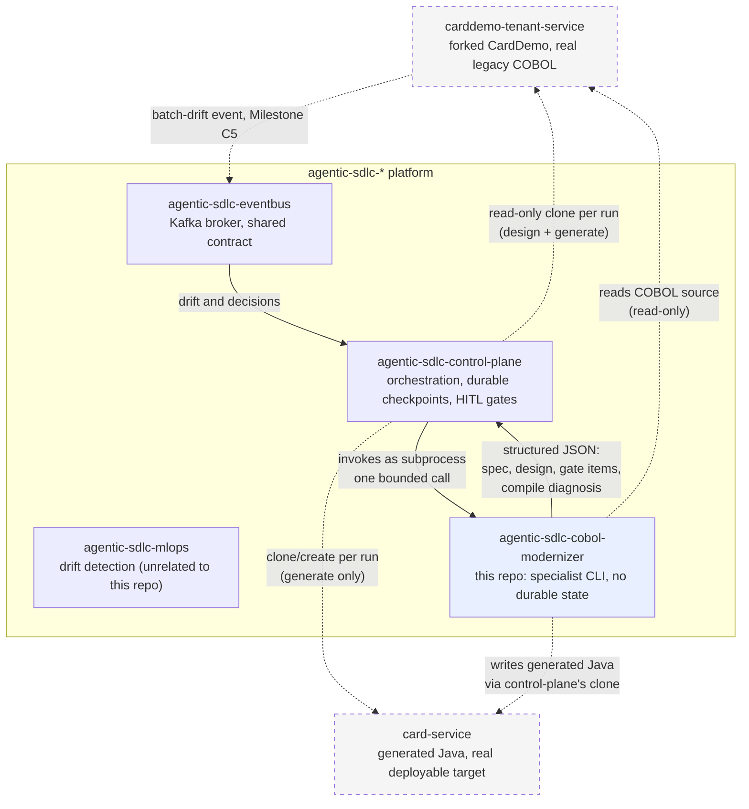

# agentic-sdlc-cobol-modernizer

COBOL-to-Java modernization specialist for the `agentic-sdlc-*` platform. Invoked as a CLI
subprocess by [`agentic-sdlc-control-plane`](https://github.com/jayakumar-devaraj/agentic-sdlc-control-plane)
— it has no ingress API, no durable checkpointer, and no human-in-the-loop gates of its own; see
[`docs/adr/0001-the-specialist-is-a-subprocess-not-a-second-control-plane.md`](docs/adr/0001-the-specialist-is-a-subprocess-not-a-second-control-plane.md)
for why.

## Tech stack

- **Language**: Python 3.12
- **Internal sub-pipeline**: LangGraph (in-process, in-memory checkpointer — not durable; see
  ADR-0001)
- **State/validation**: Pydantic
- **LLM client**: `anthropic` SDK — model per node resolved from `config/model_routing.yaml`
  (static, not a routing engine; see ADR-0004)
- **Config**: PyYAML (`config/model_routing.yaml`)
- **Testing**: pytest, pytest-cov

## Architecture

**Both halves of the diagram below run today.**
`cobol-modernizer design` executes a compiled LangGraph (ADR-0012): one concurrent branch per
requested program running `spec_extractor` then `spec_critic`, joining into a single
`solution_architect` pass that unifies every program's shared copybooks (`Account`/`CVACT01Y` alone
spans three of the four Track C programs) into one domain model (ADR-0010). It writes a real
`design.json` — including `gate_items`, the concrete payload control-plane's gate reviews (see "How
human review actually happens" below) — plus one `spec.md` per program, and reports a summary on
stdout. Every tool underneath (`parsing/`, `pic_mapper`, `tenant_repo`, `guardrails`,
`knowledge_store`, `model_routing`, `source_units`, `structured_output`) is independently tested
against real CardDemo source (`docs/qa/verification-report.md`).

Every model call goes through one client (`core/model_client.py`, ADR-0013) that owns backend
choice, timeout, bounded retry with jittered backoff, and per-call token/cost capture — so no node
reimplements any of that, and a rate limit is handled once rather than three times. Program
branches are capped rather than fanning out without limit.

**Which model runs is computed, not hardcoded** (ADR-0014, ADR-0015). `core/complexity.py` measures
the work before any call — paragraph count, field counts, and the exact prompt about to be sent —
and classifies it into a tier. `config/model_routing.yaml` then states what that tier *needs*
(minimum capability, effort, output ceiling, and a measured token profile) and names no model at
all; `config/model_catalog.yaml` holds each model's price, capability rank, and `verified_for` —
the nodes it has real benchmark evidence for. Selection is the cheapest catalogued model that
clears the bar and is verified for that node.

`verified_for` is a hard gate: adding a model to the catalog does not make it eligible, running the
benchmark does. That gate has teeth — both Sonnet models narrated an unreachable branch in
`CBACT04C` as live (the last account's interest is never posted), so neither is eligible for
`spec_extractor` despite being ~2.5× cheaper than Opus. Conversely `spec_critic` runs on Haiku,
selected on price, because a benchmark showed it catches planted defects as well as Opus does.

The decision, its estimated cost, and what it beat all ride into `design.json`, so a reviewer at
the gate can see which model produced a spec and why.

Three honest limits. **The `generate` half runs, and what it has produced is narrow.**
`cobol-modernizer generate` reads an approved `design.json`, scaffolds the target project, renders
the domain records, asks a model for one `process(...)` method body per step, compiles the project,
and — while `build_validator` judges that a rewrite could help — asks for one, at most three times
(ADR-0020). The model-authored region is marked in every generated file so a reviewer can see which
lines a model wrote, and a compile error outside that region blocks rather than being handed back to
a model. What that does **not** yet amount to: the only body compiled so far is a scripted
pass-through, **no real model has written business logic through this path**, nothing has been
written to the real `card-service` repository, and **no generated program has been checked against
its COBOL for equivalence** — that is step 45. Step 40a's loader now exists (`tools/data_loader.py`,
reading CardDemo's fixed-width files into PostgreSQL with `pic_mapper`-derived types), but it also
established that **every balance in the shipped data is zero**, so step 45 needs non-zero inputs
before an equivalence test could mean anything.
**Retrieval is not wired**: `tools/knowledge_store.py` is a real,
tested pgvector storage layer with no production caller, because embeddings need a second vendor
this environment has no credential for — and because nobody has shown retrieval would help a
four-program corpus (`docs/adr/0016` decides both halves of that). And **output quality is only
spot-measured**: real `design` runs against real models have happened, and two benchmarks scored
their output by hand, but that is four programs' worth of evidence, not a standing evaluation
harness.

### How this repo fits in the platform



Every solid arrow into or out of this repo is a single bounded subprocess call. This repo never
talks to Kafka, or either repo's git remote, directly — control-plane owns both clones and hands
this repo worktree paths (`docs/adr/0001`).
[`card-service`](https://github.com/jayakumar-devaraj/card-service) (ADR-0009) is the `generate`
phase's write target — not this repo's own output, and not `carddemo-tenant-service`'s, which
stays read-only source of truth throughout. **The repository itself is still an empty scaffold** —
`generate` can now write a compiling project into a target directory, but nothing has been committed
to `card-service` itself, and doing that is control-plane's job through its own clone (ADR-0001). What that target looks like is decided: Java 25 on Spring Batch over **PostgreSQL**,
with CardDemo's data files as a one-time migration source rather than the runtime store, and
`CBACT01C`'s fixed-`OCCURS` demo outputs scoped out of generation entirely (`docs/adr/0019`). This repo has **no Postgres edge in the diagram on purpose**: two modules can talk to
PostgreSQL — `tools/knowledge_store.py` for the knowledge store's own schema, and
`tools/data_loader.py` for migrating CardDemo's data files into the target's tables — but neither is
called from the `design` or `generate` path (`docs/adr/0016`, `docs/adr/0019`), so today both
connections are exercised only by their own tests against a local container. When it is wired, the credential arrives as a mounted file path and never
as an embedded value or an environment variable (`docs/adr/0005`). Durable orchestration state
stays entirely control-plane's concern either way.

### This repo's internal pipeline — two separate, independently bounded invocations

Not one continuous flow: this repo has no durable state (ADR-0001), so it cannot pause mid-run for
a human gate and resume later. Control-plane's gate sits *between* two separate process
invocations, never inside one (ADR-0003).


**Every** program runs as its own concurrent branch, not just the `CBCUS01C`/`CBACT01C` pair. An
earlier revision of this diagram ran those two in parallel and chained `CBTRN02C` and `CBACT04C`
after the join, on the reasoning that the latter two "both depend on account data". Building it
showed that reasoning does not apply here: the dependency is on the `CVACT01Y` *copybook*, which
each branch reads independently from the tenant worktree — no branch consumes another branch's
output, so there is nothing to serialize. The only real join is `solution_architect`, which by
definition needs all of them (ADR-0010). Fan-out is dynamic over whatever `--programs` is passed,
so the topology is not tied to these four names. Branches are genuinely concurrent, on a real
thread pool — measured, not assumed (ADR-0012).

The self-healing loop is a bounded retry, not an open-ended one — a third failed compile returns a
result to control-plane rather than looping forever. `design.json` must be fully self-contained (ADR-0003): invocation 2 has no access to
anything invocation 1 reasoned about that isn't written into that file. `CODE`'s output lands in
`card-service`, not this repo or `carddemo-tenant-service` (ADR-0009) — `generate --output <path>`
resolves to control-plane's clone of that target repo's worktree.

### How human review actually happens (the HITL story, in one place)

This repo has **no** human-in-the-loop gate of its own, and that's a deliberate strength, not a
missing feature — a gate needs to be durable (survive a crash, not just this bounded subprocess),
sit at a complete checkpoint boundary, and never be judged by the same component that produced the
work. `agentic-sdlc-control-plane` already has all three: a Postgres-checkpointed graph, 5
`interrupt()`-backed gate types, and a hash-chained audit log. Building a second, weaker version of
that here would be exactly the "second control plane" `docs/adr/0001` exists to prevent.

What this repo *does* own is making sure that gate has something real to review:

1. `spec_extractor` and `spec_critic` never guess past an ambiguous case — a `REDEFINES` field is
   flagged (`docs/adr/0002`, `docs/adr/0006`), a narration defect forces confidence to `0.0`
   rather than being averaged away (`docs/adr/0007`), a prompt-injection heuristic match is
   surfaced, never silently acted on.
2. `core/contracts.py`'s `build_gate_items()` consolidates all four of those signal types, across
   every program in one `design` run, into one `gate_items` list in `design.json`
   (`docs/adr/0008`) — a human reviewing the gate reads one list, not four separate structures per
   program.
3. This repo never decides what happens next with a gate item. No approve/reject, no blocking —
   `gate_items` states facts; whether `gate_item_count > 0` pauses anything is control-plane's gate
   policy, decided over there, not baked into this repo's CLI contract.

`design.json`'s full shape (and the CLI's own summary-only stdout contract, `DesignCliResult`) is
formally schema'd — `schemas/design_document.schema.json`, generated from the Pydantic models and
checked for drift in CI (`tests/system/test_schemas.py`), so an external consumer never has to
trust a hand-written copy of the contract.

### What this design deliberately doesn't buy

- **No resume mid-pipeline.** A crash during this repo's own invocation loses that invocation's
  progress; control-plane recovers by re-invoking the CLI, not by anything built here
  (`docs/adr/0001`, Consequences).
- **`spec_critic`'s confidence score is the only independent check on extraction quality** for
  Track C. It is not a second, adversarial review — see the same ADR for why `REDEFINES`/
  `OCCURS DEPENDING ON` (Track B) get a stricter, mandatory gate instead of a confidence score.
- **The parser has a hard, enforced boundary.** `REDEFINES`, `OCCURS DEPENDING ON`, and
  `COPY REPLACING` are detected and rejected, never partially interpreted (`docs/adr/0002`).

## Quickstart

```bash
py -3.12 -m venv .venv
./.venv/Scripts/pip install -e ".[dev]"
./.venv/Scripts/cobol-modernizer design --programs CBCUS01C CBACT01C CBTRN02C CBACT04C --tenant-repo <path> --output <path> --json
./.venv/Scripts/cobol-modernizer generate --design <path>/design.json --tenant-repo <path> --output <path> --json
```

`design` is real and runs the full pipeline. By default it reaches a model through the **`claude`
CLI** (ADR-0013), which authenticates from an existing Claude subscription — **no API key
required**. Set `COBOL_MODERNIZER_MODEL_BACKEND=anthropic_sdk` to use the Anthropic API directly
instead (needs `ANTHROPIC_API_KEY`); that is the right choice for a deployment that needs
per-tenant quotas and real cost attribution. It writes
`<output>/design.json` and `<output>/<PROGRAM>/spec.md` per program, and exits non-zero with a
`status: "error"` object on stdout if anything fails. Pass `--run-id` to reuse control-plane's own
audit-log run id, so its records and this CLI's stderr logs share one identifier; omit it and one
is generated and reported back. `generate` still returns an error status — it lands in Milestone C4.

With `--json`, stdout carries exactly one JSON object and nothing else; all logging goes to stderr.
Two subcommands, not one — see `docs/adr/0003` for why.

## Local development

```bash
docker compose up -d postgres
```

Stands up a local Postgres+pgvector instance (`localhost:5434`) for `tools/knowledge_store.py` —
deliberately isolated from `agentic-sdlc-control-plane`'s own Postgres instance, which real
deployment reuses instead (`docs/adr/0005`). This is a throwaway dev/test resource this repo fully
owns; production never points at it. `tests/fixtures/db_credentials_sample/local.conn` has the
matching local credentials pre-filled (a docker-compose default password for a local-only,
unreachable-from-outside container, not a real secret — see that file's own header comment).

`templates/target-spring-boot-baseline/` is a real Maven project, not a scaffold of placeholders —
`mvn -B verify` inside it needs **JDK 25** and a running Docker daemon, and CI builds it on every
push. There is still no sandboxed-compiler stack driving it from Python; that's the rest of
Milestone C4.

## Testing

```bash
./.venv/Scripts/python -m pytest --cov=cobol_modernizer --cov-report=term-missing --cov-fail-under=90
```

640 tests passing (4 skipped — the opt-in live-CLI tests), 98.66% coverage — CI's own numbers from
the run on this change, not a local approximation of them. The Postgres-backed
`tools/knowledge_store.py` suite is included and skips nothing there, because CI provides a real
service container. The target template's own 13 Java tests are not in that
figure; CI runs them separately on JDK 25 (`mvn -B verify`, job `template-build`). Some tests (`tools/knowledge_store.py`'s) need the local
Postgres+pgvector instance above; they skip with a clear reason rather than failing if it isn't
running, and CI runs them for real against its own service container rather than letting them skip
silently there too. If that local instance predates `docs/adr/0016`, its `knowledge_entries` table
still declares `vector(1536)` and `ensure_schema` will refuse it by name — drop the table once and
re-run. CI is unaffected; its Postgres service container is fresh every run.

## Deployment / CI

`.github/workflows/ci.yml` runs lint + the test suite with the coverage floor above on every push
and pull request, and a second job (`template-build`) compiles and tests
`templates/target-spring-boot-baseline/` on JDK 25 against a real PostgreSQL container. That job
exists so an ecosystem dependency that has not caught up to the pinned JDK fails here rather than
inside the self-healing compile loop, where a compile-error-driven loop cannot diagnose it
(`docs/adr/0019`). No deployment pipeline yet — this repo has nothing running in production until
control-plane's specialist router (Track P) can invoke it, and Kubernetes/Terraform manifests
(Track P4, in `agentic-sdlc-control-plane`) exist to run it against.
